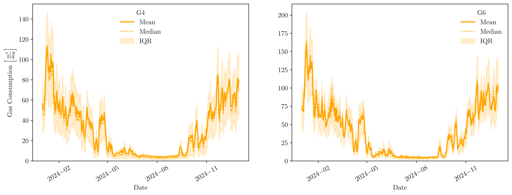
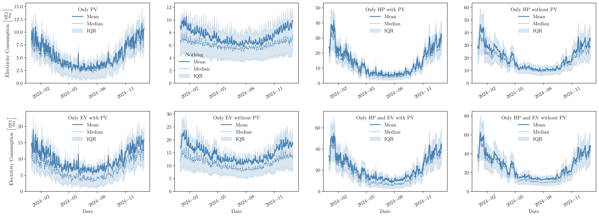
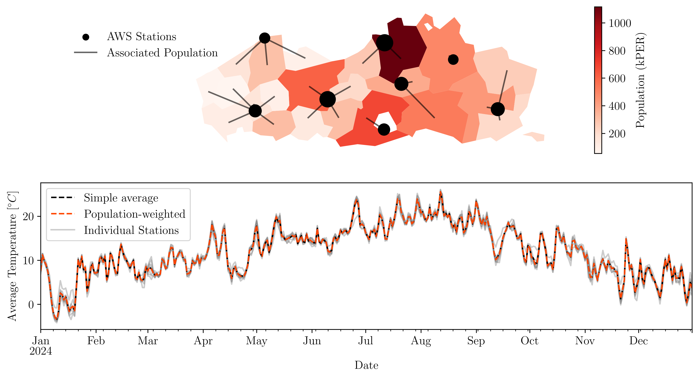

# LOADid - Identifying energy consumption associated with heating residential buildings
## A case study from Flanders, Belgium

This project proposes the use of a grey-box model to identify the equipment and energy consumption patterns associated with daily load profiles in residential buildings. The model allows the underlying components of energy demand to be identified and enables long-term consumption projections to be developed under different scenarios.

## Data

Electricity and gas consumption data are sourced from the [Fluvius open data portal](https://opendata.fluvius.be/pages/homepage_v30/). The datasets used in this study are:

- [Hourly gas meters](https://opendata.fluvius.be/explore/assets/1_50-verbruiksprofielen-dm-gas-uurwaarden-voor-een-volledig-jaar/)

    

- [Quarter-hourly electricity meters](https://opendata.fluvius.be/explore/assets/1_50-verbruiksprofielen-dm-elek-kwartierwaarden-voor-een-volledig-jaar/)

    

The datasets are provided as raw files and have been unzipped and stored in the [Elec](Data/Raw/Elec/) and [Gas](Data/Raw/Gas/) directories. They are subsequently preprocessed using the scripts in the [Preprocess](Preprocess/) directory to obtain daily load profiles.

Weather data are obtained from the [Royal Meteorological Institute of Belgium](https://opendata.meteo.be/). Since the exact locations of the consumers are unknown, weather conditions are estimated by combining observations from different weather stations using population-weighted averages.

## Model

The proposed grey-box model decomposes energy consumption into several interpretable components. The energy demand associated with heating is then isolated from the overall load profile, allowing the model to be expressed in terms of directly interpretable parameters:

$$ y = y_0 + (\alpha + \omega_h W) \cdot \left((T_h - \gamma G) - T^{(w, n)}\right)^+ - \rho \cdot \left(1 - e^{-G/\tau}\right) + \epsilon \quad \tag{1} $$ 

The model is inspired by *Rasmussen, Christoffer, et al. (2020)*.

The parameters estimated for each consumer are subsequently used as input features for a Random Forest-based classifier, with the objective of identifying the equipment and/or heating systems associated with the observed load profiles.

## Projection

The model parameters estimated for each consumer are then used to produce long-term energy consumption projections under different scenarios. These projections are used to assess how residential energy demand and heating-related consumption could evolve up to 2050.